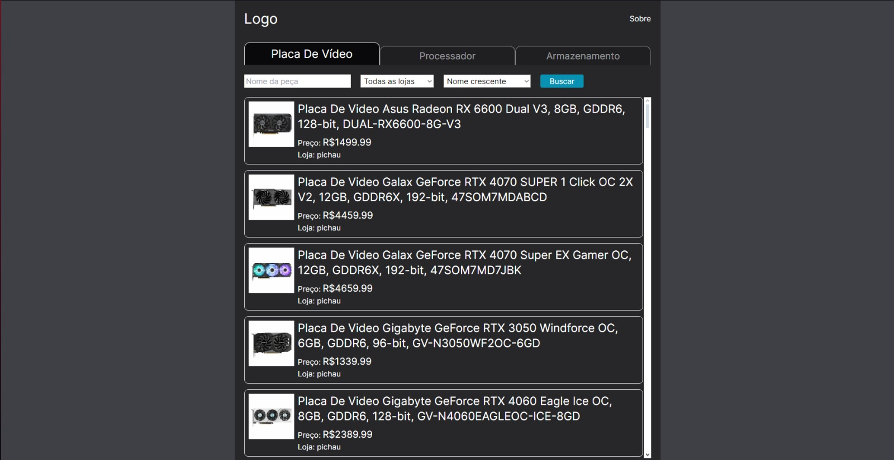
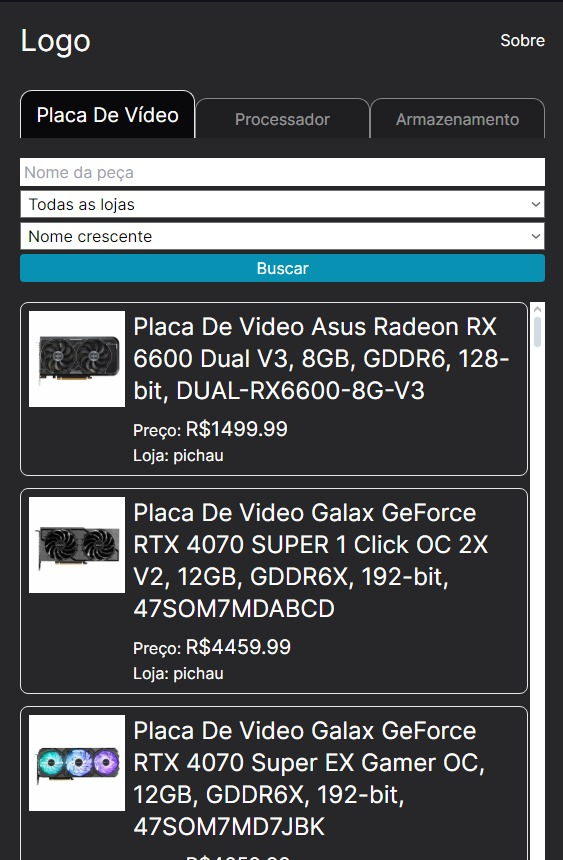

# Scrapping de Preços de Componentes Eletrônicos

Este projeto visa automatizar a coleta de preços e informações de componentes eletrônicos em sites populares como Terabyte, Kabum e Pichau, a fim de facilitar a comparação de preços e auxiliar na tomada de decisões de compra. Esse projeto tem duas partes, sendo ela o back-end e o front-end, sendo necessário inicializar as duas para assim o projeto funcionar, não consegui dockerizar tudo ainda, mas em próximas atualizações, já dockerizo.

Nesse projeto utilizei NodeJS, NextJS, Puppeteer, Tailwind CSS e mais algumas outras bibliotecas que ajudam o desenvolvimento.

## Back-end (NodeJS)

O back-end é responsável por realizar o scraping dos sites e disponibilizar os dados através de uma API RESTful. As principais rotas são:

-   `/terabyte/search/{produto}`
-   `/kabum/search/{produto}`
-   `/pichau/search/{produto}`

Onde `{produto}` pode ser `placavideoamd`, `placavideonvidia`, `processadorintel`, `processadoramd` ou `promocoes`.

Para rodar o back-end, execute `npm run dev` na raiz do projeto.

## Front-end (NextJS)

O front-end consome a API do back-end e apresenta os dados de forma organizada e intuitiva. É possível realizar buscas, filtrar os resultados e comparar os preços dos diferentes produtos.

Para iniciar o desenvolvimento do front-end, execute `npm run dev` na pasta do front-end.

### Descktop

### Mobile

